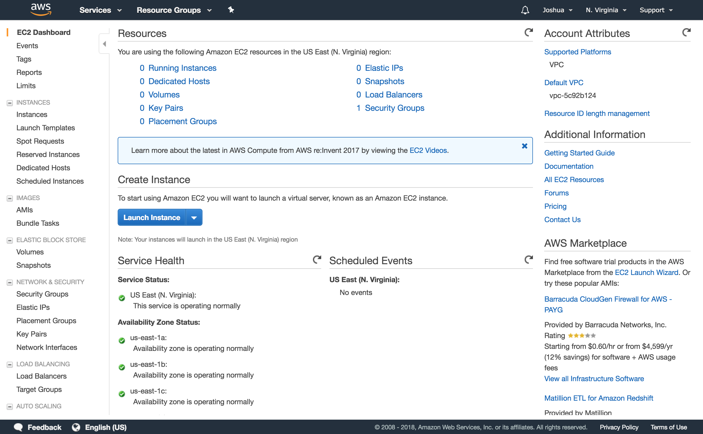
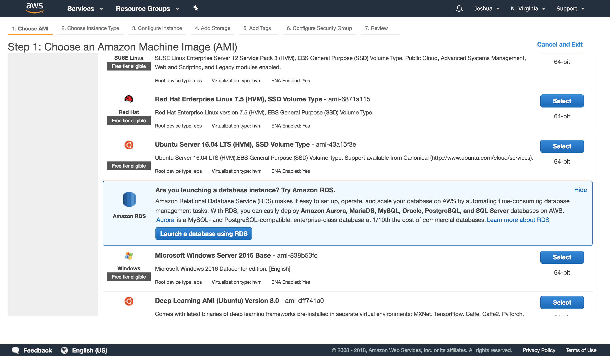
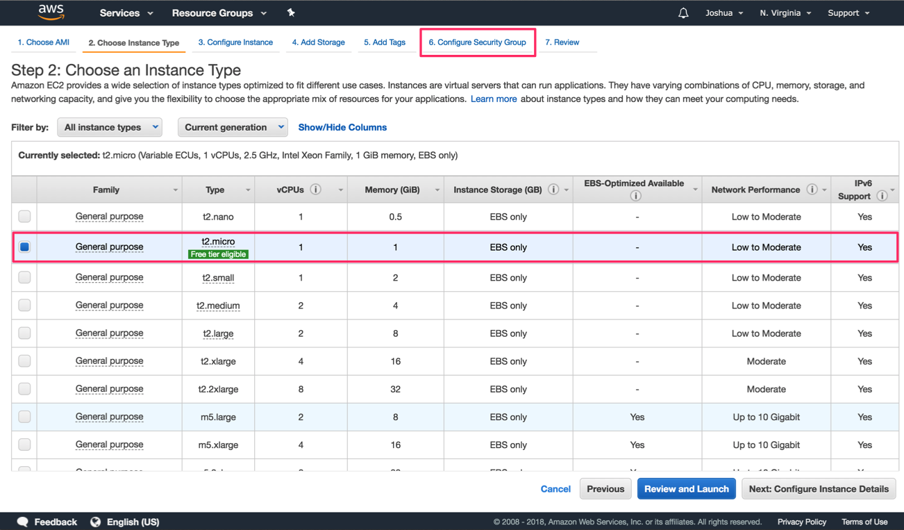
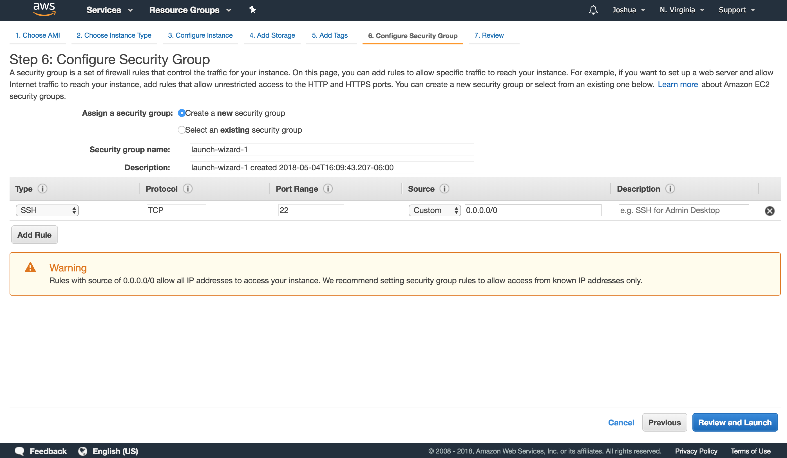
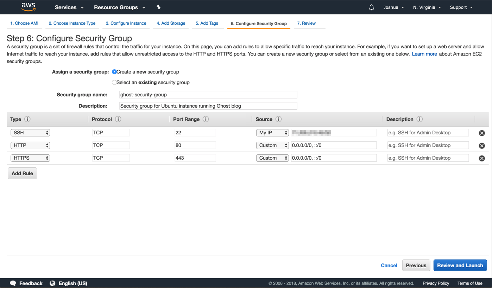
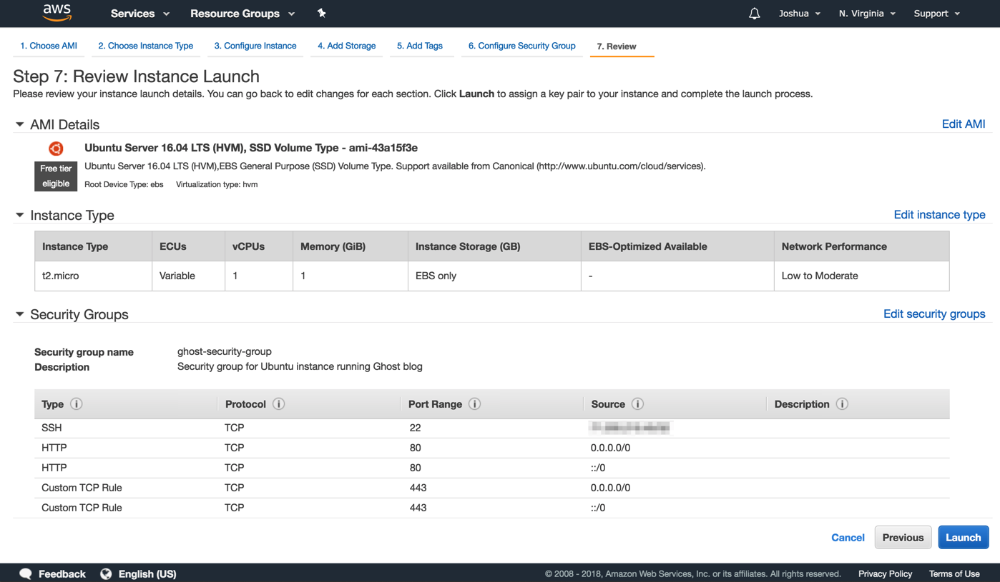
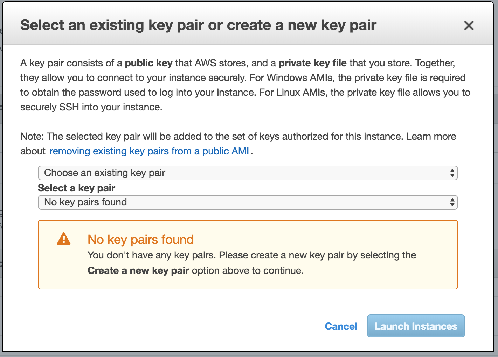
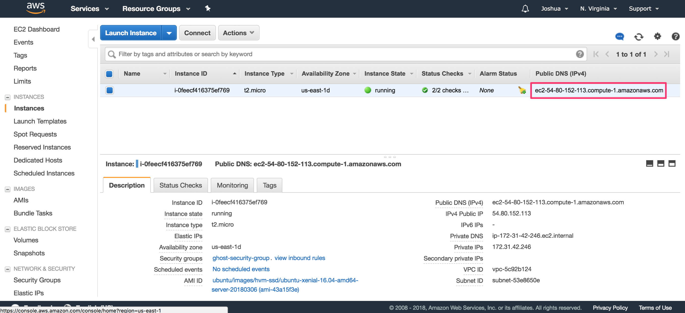

# Ghost Hosting Tutorial: AWS

## Purpose

The purpose of this document is to detail how to spin up an EC2 instance running Ubuntu 16.04 LTS, and run the Ghost publishing platform. We'll assume that you already have already created and set up an Amazon Web Services (AWS) account. If not, you can find information on how to do that [here](https://aws.amazon.com/premiumsupport/knowledge-center/create-and-activate-aws-account/).

## Configuring the EC2 Instance

The first thing we need to do is configure an EC2 instance. In case you're not familiar yet, an EC2 instance is a virtual server that's hosted on Amazon's infrastructure. EC2 isntances come pre-installed with an operating system (Ubuntu 16.04 LTS in our case), so once the instance has been launched, we can SSH into it and interact with the instance via the terminal just as if it was a physical server.

### Begin Instance Configuration

After you'd logged into AWS and you're on the landing page, select the EC2 service. You will arrive at the EC2 Dashboard. If that shiny blue "Launch Instance" button is begging you to click it, you're in luck, because that's exactly what we're going to do.



### Select Machine Image

This will begin the process of configuring the EC2 instance you wish to launch. First, you need to decide on the machine image you want. This is akin to selecting what operating system you'd like to run on the server. We're going to use the **Ubuntu Server 16.04 LST (HVM), SSD Volume Type** instance, because Ubuntu 16.04 LTS is officially supported by Ghost. Click on the "Select" button for that instance.



### Select Instance Type

Next, we will pick our instance type. This is akin to selecting server hardware. We will choice the **t2.micro** instance type. This instance type is nothing special, but it's nice for a couple of reasons. 1) It resides in the free-tier of AWS, so if you're just trying out AWS for the first time, this should be free for a certain period of time, and 2) I has 1 GB of memory, the minimum required to run Ghost. Make sure the **t2.micro** isntance type is selected, and click the **6. Configure Security Group** tab.

> **Note:** We skipped steps 3 - 5, which deal with specific configuration, storage, and tagging of our instance, as they're not relevant to this walkthrough.



### Configure the Security Group

In this step, we will define what kind of connections we'll allow to our instance. AWS will block everything by default, so you'll need to enable the specific traffic you want to allow. In the default configuration, AWS will allow SSH over port 22 from anywhere in the internet.



You can leave this as is if you wish, but for this tutorial we will select the source as **My IP**. We also want to allow HTTP(S) traffic from the Internet, so click the "Add Rule" button and add HTTP and HTTPS to your security group. While we're at it, it's a good practice to name your security group and give it a good description. Here's what the final configuration should look like:



### Review Instance Configuration

Click the "Review and Launch" button. Go ahead and review everything and make sure nothing sticks out as odd. Here's a checklist:

1. AMI is Ubuntu Server 16.04 LTS (HVM), SSD Volume Type
2. Instance type is t2.micro
3. Security group is appropriately named, has a good description
4. You're allowing SSH on port 22
5. You're allowing HTTP on port 80
6. You're allowing HTTPS on port 443 (this will appear as "Custom TCP Rule")

Ultimately, it should look very similar to the image below:



### Key Setup

Click the "Launch" button. When you click this AWS will give show a modal asking you to either select an existing key pair, or create a new one. Create a new one if needed, download the key, and click "Launch Instances".



On the next page, you should get confirmation that your instance is being launched. Click the "View Instances" button and you should see your instance either launching, or already launched.

## Connecting to your Instance

Select the instance you just launched and click the "Connect" button. Follow the instructions, making sure your key is not publically viewable, the doing an ssh into your EC2 isntance:

```
$ cd <directory-of-your-key>
$ chmod 400 ghost-ubuntu-key.pem
$ ssh -i "ghost-ubuntu-key.pem" <public-dns-for-your-instance>
```

You should be prompted on whether or not you want to continue, as the authenticity of the host cannot be established. Continue through this and you should successfully access your EC2 instance:

```
ubuntu@<ec2-instance-public-ip>:~$
```

## Installing Ghost

First, we will need to establish all the prerequisites for install Ghost-CLI, Ghost's command line interface tool. Using the command line, setup a new user and log in as the created user (note: everything after `#` is a comment and should not be included in the command):

```
ubuntu:~$ sudo adduser ghost-user          # add new user
ubuntu:~$ sudo usermod -aG sudo ghost-user # give new user elevated permissions
ubuntu:~$ su - ghost-user                  # login as new user
ghost-user:~$
```

Next, update the package list and upgrade the install packages:

```
ghost-user:~$ sudo apt-get update && sudo apt-get upgrade
```

Install NGINX:

```
ghost-user:~$ sudo apt-get install nginx
```

Make sure the firewall allows HTTP(S) connections:

```
ghost-user:~$ sudo ufw allow 'Nginx Full'
```

Install MySQL, *making sure to set a password for the root user*:

```
ghost-user:~$ sudo apt-get install mysql-server
```

Next, we will add the NodeSource APT repository for Node 6 so that we can install Node.Js, then we will install Node.js:

```
ghost-user:~$ curl -sL https://deb.nodesource.com/setup_6.x | sudo -E bash
ghost-user:~$ sudo apt-get install -y nodejs
```

Let's install the Ghost-CLI:

```
ghost-user:~$ sudo npm i -g ghost-cli
```

And then verify it installed correctly:

```
ghost-user:~$ ghost help
```

Now create a new folder for Ghost to reside, give your ghost-user ownership of this direction, give the folder the correct permissions, and navigate to the folder:

```
ghost-user:~$ sudo mkdir -p /var/www/ghost
ghost-user:~$ sudo chown ghost-user:ghost-user /var/www/ghost
ghost-user:~$ sudo chmod 775 /var/www/ghost
ghost-user:~$ cd /var/www/ghost
```

And now, the moment you're been waiting for. Install Ghost:

```
ghost-user:/var/www/ghost$ ghost install
```

You'll be asked a few questions during the setup, the first being what you'd like your blog URL to be. Go back to your AWS console and check out your EC2 instances. Under the "Public DNS (IPv4)" column, you will see the public address for your EC2 instance that is running Ghost. 



Copy that to your clipboard and return to the SSH session in your command line. The entry for your prompts shoud look like this:

```
? Enter your blog URL: http://<paste-your-public-dns-here>
? Enter your MySQL hostname: localhost
? Enter your MySQL username: root
? Enter your MySQL password: [hidden]
? Enter your Ghost database name: ghost_prod
? Do you wish to set up "ghost" mysql user? Yes
? Do you wish to set up Nginx? Yes
? Do you wish to set up SSL? No
? Do you wish to set up Systemd? Yes
? Do you want to start Ghost? Yes
```

Now that Ghost is running, go ahead and paste the URL you copied earlier into your favorite web browser and admire your handy work!

