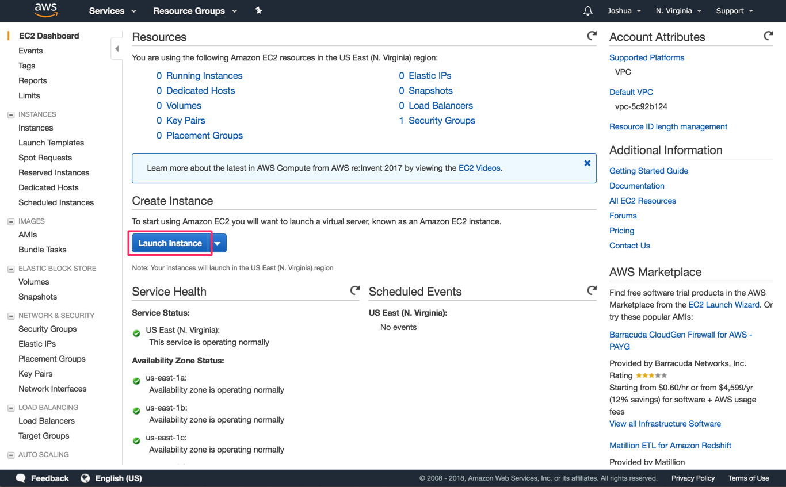
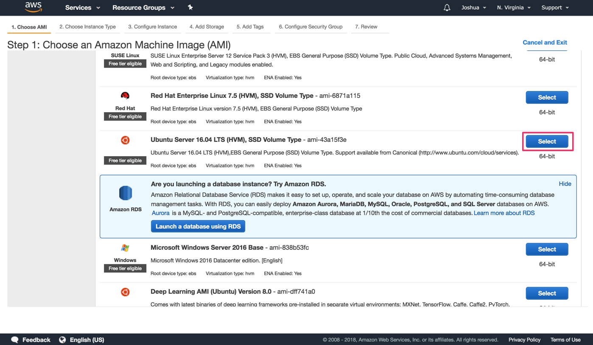

# Ghost Hosting Tutorial: AWS

## Purpose

The purpose of this document is to detail how to spin up an EC2 instance running Ubuntu 16.04 LTS, and run the Ghost publishing platform. We'll assume that you already have already created and set up an Amazon Web Services (AWS) account. If not, you can find information on how to do that [here](https://aws.amazon.com/premiumsupport/knowledge-center/create-and-activate-aws-account/).

## Configuring the EC2 Instance

The first thing we need to do is configure an EC2 instance. In case you're not familiar yet, an EC2 instance is a virtual server that's hosted on Amazon's infrastructure. EC2 isntances come pre-installed with an operating system (Ubuntu 16.04 LTS in our case), so once the instance has been launched, we can SSH into it and interact with the instance via the terminal just as if it was a physical server.

After you'd logged into AWS and you're on the landing page, select the EC2 service. You will arrive at the EC2 Dashboard. If that shiny blue "Launch Instance" button is begging you to click it, you're in luck, because that's exactly what we're going to do.

This will begin the process of configuring the EC2 instance you wish to launch. First, you need to decide on the machine image you want. This is akin to selecting what operating system you'd like to run on the server. We're going to use the **Ubuntu Server 16.04 LST (HVM), SSD Volume Type** instance, because Ubuntu 16.04 LTS is officially supported by Ghost. Click on the Select button for that instance.

Next, we will pick our instance type. This is akin to selecting server hardware. We will choice the **t2.micro** instance type. This instance type is nothing special, but it's nice for a couple of reasons. 1) It resides in the free-tier of AWS, so if you're just trying out AWS for the first time, this should be free for a certain period of time, and 2) I has 1 GB of memory, the minimum required to run Ghost. Make sure the **t2.micro** isntance type is selected, and click the **6. Configure Security Group** tab.

> **Note:** We skipped steps 3 - 5, which deal with specific configuration, storage, and tagging of our instance, as they're not relevant to this walkthrough.

